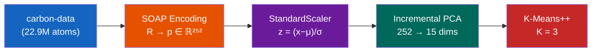

# Unsupervised Classification of Carbon Material Structures via SOAP Descriptors

An end-to-end machine learning pipeline for the automatic, unsupervised classification of carbon allotrope structures based on three-dimensional atomic coordinates. The method leverages Smooth Overlap of Atomic Positions (SOAP) descriptors \[1\] to encode local structural environments into rotation-invariant fingerprints, followed by dimensionality reduction (PCA) and K-Means++ clustering.

## Pipeline Overview



| Stage | Transformation | Method |
|-------|---------------|--------|
| 1 | `.extxyz` → `ASE.Atoms` | Parse MD trajectory snapshots with density/temperature metadata |
| 2 | `R ∈ ℝ^(N×3)` → `p ∈ ℝ^D` | SOAP power spectrum (species=\[C\], periodic, inner-averaged) |
| 3 | `X ∈ ℝ^(M×D)` → `Z ∈ ℝ^(M×k)` | Welford online StandardScaler → Incremental PCA |
| 4 | `Z` → `L ∈ {1,...,K}^M` | MiniBatch K-Means++ with Silhouette-based K selection |

## Dataset

**Source**: Gardner, Faure Beaulieu & Deringer — [jla-gardner/carbon-data](https://github.com/jla-gardner/carbon-data) \[2\]

The dataset comprises 22.9 million carbon atoms generated via molecular dynamics (MD) simulations using the LAMMPS code \[3\] with the C-GAP-17 interatomic potential \[4\]. Structures span diverse carbon environments:

| Environment | Density (g/cm³) | Bonding | Structure |
|-------------|:--------------:|:-------:|-----------|
| Graphitic films | 1.0 – 1.5 | sp² | Layered hexagonal |
| Carbon nanotubes | 1.3 – 1.4 | sp² | Rolled sheets |
| Amorphous carbon | 1.8 – 3.0 | sp²/sp³ | Disordered |
| Diamond-like | 3.0 – 3.5 | sp³ | Tetrahedral |

**Key property**: The dataset is **100% Carbon**, making `species=['C']` in SOAP descriptors scientifically valid — no information is lost from missing cross-species correlations.

<details>
<summary><strong>Generation procedure</strong></summary>

1. **Initialization**: Random 200-atom configurations at target density (hard-sphere constraint)
2. **Melt–Quench**: Heat to liquid phase, then rapid quench to produce metastable structures
3. **Anneal**: Hold at anneal temperature; sample at 1 ps intervals (210 snapshots/trajectory)
4. **Labeling**: Local energies computed with C-GAP-17 Gaussian Approximation Potential

546 trajectories × 210 snapshots × 200 atoms = **22.9M atomic environments**
</details>

## SOAP Descriptor Configuration

The SOAP descriptor \[1\] encodes local atomic environments via the power spectrum of the neighbor density expanded in radial-angular basis functions:

```
ρᵢ(r) = Σⱼ exp(−|r − rⱼ|² / 2σ²) · fcut(|rⱼ − rᵢ|)

p(n, n', l) = π√(8/(2l+1)) · Σₘ cₙₗₘ* · cₙ'ₗₘ
```

| Parameter | Value | Rationale |
|-----------|:-----:|-----------|
| `species` | `['C']` | Single-element dataset — captures C–C geometry only |
| `r_cut` | 6.0 Å | ~3 neighbor shells (C–C bond: 1.42 Å graphene, 1.54 Å diamond) |
| `n_max` | 8 | Radial basis resolution |
| `l_max` | 6 | Angular basis resolution (balanced precision/cost) |
| `sigma` | 0.5 Å | Tight Gaussian smearing for crystalline structures |
| `periodic` | True | Structures have periodic boundary conditions |
| `average` | inner | Preserves cross-correlations between atomic sites |
| **Features** | **252** | n_max(n_max+1)/2 × (l_max+1) = 36 × 7 |

## Training Results

To accommodate standard hardware limits (e.g., Kaggle's 14 GB RAM and 9-hour timeout) while preserving the dataset's physical diversity, the model was trained on a **representative subset of 27,300 structures (5.46 million atoms)**, sampled evenly across all 546 trajectories (50 snapshots per trajectory).

### Dimensionality Reduction

PCA reduced 252 SOAP features → **15 principal components**, retaining **≥95% cumulative variance**. The requirement for 15 PCs (vs. only 5 with QM9) confirms the structural diversity of the carbon-data dataset.

### Clustering

K-Means++ identified **K = 3** optimal clusters:

| Cluster | Structures | Interpretation |
|:-------:|:----------:|----------------|
| 0 | — | Low-density graphitic / CNT-like environments |
| 1 | — | Intermediate amorphous carbon |
| 2 | — | High-density diamond-like structures |

## Repository Structure

```
├── kaggle_notebook.py      # Full training pipeline (Kaggle-compatible)
├── predict.py              # Inference on new structures
├── export_models.py        # Extract models from Kaggle checkpoints
├── requirements.txt        # Python dependencies
├── PROJECT_REPORT.html     # Formal project report (printable)
├── TRAINING_GUIDE.md       # Step-by-step training guide
│
├── models/                 # Trained models
│   ├── scaler.pkl          # Welford StandardScaler (μ, σ)
│   ├── ipca.pkl            # Incremental PCA (15 components)
│   ├── kmeans.pkl          # MiniBatch K-Means (K=3)
│   ├── config.json         # Hyperparameters & metadata
│   └── cumulative_variance.npy
│
└── results/                # Visualizations
    ├── pca_variance.png
    ├── clustering_results.png
    ├── anomaly_summary.png
    ├── clusters_3d.png
    └── cluster_properties.png
```

## Quick Start

### Inference

```bash
pip install dscribe ase scikit-learn numpy
python predict.py structure.extxyz --models-dir ./models
```

### Train from Scratch

See [TRAINING_GUIDE.md](TRAINING_GUIDE.md) for full instructions. Summary:

```bash
# On Kaggle: paste kaggle_notebook.py into a Code cell, enable Internet, Run All
# Locally:
pip install -r requirements.txt
python kaggle_notebook.py
```

## References

\[1\] Bartók, A.P., Kondor, R., Csányi, G. (2013). On representing chemical environments. *Phys. Rev. B*, 87, 184115. [doi:10.1103/PhysRevB.87.184115](https://doi.org/10.1103/PhysRevB.87.184115)

\[2\] Gardner, J.L.A., Faure Beaulieu, Z., Deringer, V.L. (2022). Synthetic Data Enable Experiments in Atomistic Machine Learning. [arXiv:2211.16443](https://arxiv.org/abs/2211.16443)

\[3\] Thompson, A.P. et al. (2022). LAMMPS — a flexible simulation tool for particle-based materials modeling. *Comput. Phys. Commun.*, 271, 108171. [doi:10.1016/j.cpc.2021.108171](https://doi.org/10.1016/j.cpc.2021.108171)

\[4\] Deringer, V.L., Csányi, G. (2017). Machine learning based interatomic potential for amorphous carbon. *Phys. Rev. B*, 95, 094203. [doi:10.1103/PhysRevB.95.094203](https://doi.org/10.1103/PhysRevB.95.094203)

\[5\] Himanen, L. et al. (2020). DScribe: Library of descriptors for machine learning in materials science. *Comput. Phys. Commun.*, 247, 106949. [doi:10.1016/j.cpc.2019.106949](https://doi.org/10.1016/j.cpc.2019.106949)

## License

MIT
