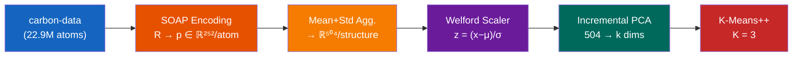

# Unsupervised Classification of Continuous Carbon Phases via Rotation-Invariant SOAP Descriptors

> **An end-to-end, unsupervised machine learning pipeline that encodes three-dimensional atomic environments from molecular dynamics simulations into rotationally invariant geometric fingerprints, automatically recovering the tripartite phase taxonomy of carbon (graphitic, amorphous, diamond-like) without any prior physical labels.**

---

## Table of Contents

- [Scientific Background](#scientific-background)
- [Pipeline Architecture](#pipeline-architecture)
- [Dataset](#dataset)
- [SOAP Descriptor Theory](#soap-descriptor-theory)
- [Dimensionality Reduction](#dimensionality-reduction)
- [Clustering on Continuous Phase Manifolds](#clustering-on-continuous-phase-manifolds)
- [Empirical Results](#empirical-results)
- [Repository Structure](#repository-structure)
- [Quick Start](#quick-start)
- [References](#references)
- [License](#license)

---

## Scientific Background

### The Carbon Phase Continuum

Carbon is arguably the most structurally versatile element in the periodic table. Its ability to adopt sp, sp², and sp³ hybridization states gives rise to an extraordinary diversity of allotropes — from planar graphene sheets and cylindrical nanotubes (sp²) to crystalline diamond (sp³). In the condensed phase, these idealized extremes are connected by a **continuous spectrum of disordered, amorphous states** \[1\] where varying fractions of sp² and sp³ bonding coexist within the same structure.

This continuum poses a fundamental classification challenge: unlike molecular species that can be discretely categorized, carbon phases transition *smoothly* across a connected thermodynamic manifold. The density alone spans from ~1.0 g/cm³ (porous graphitic networks) through ~2.0–2.5 g/cm³ (glassy amorphous carbon, a-C) to ~3.0–3.5 g/cm³ (tetrahedral amorphous carbon, ta-C, approaching crystalline diamond at 3.515 g/cm³) \[2\].

### Why Machine Learning?

Traditional structural analysis methods — radial distribution functions (RDF), coordination number histograms, and ring statistics — provide valuable but *scalar* summaries that collapse the rich many-body correlations present in disordered networks. Modern atomistic descriptors, particularly the **Smooth Overlap of Atomic Positions (SOAP)** framework \[3\], encode the *complete* local geometric environment up to a chosen radial cutoff into a high-dimensional vector that is by construction invariant under rotation, translation, and permutation of equivalent atoms. Coupling SOAP with unsupervised learning enables the discovery of structural groupings *directly from geometry*, without imposing human-defined categories.

---

## Pipeline Architecture



| Stage | Input → Output | Method | Scientific Justification |
|:-----:|----------------|--------|--------------------------|
| 1 | `.extxyz` → `ASE.Atoms` | Parse MD trajectory snapshots | Preserves periodic boundary conditions, density, and temperature metadata |
| 2 | `R ∈ ℝ^(N×3)` → `p ∈ ℝ^(2D)` | SOAP power spectrum (per-atom) + mean/std aggregation | Per-atom descriptors preserve local geometric detail; mean+std concatenation captures both the average environment and its heterogeneity within each structure |
| 3 | `X ∈ ℝ^(M×504)` → `Z ∈ ℝ^(M×k)` | Welford + IPCA | Online standardization prevents feature dominance; PCA embeds the structural manifold |
| 4 | `Z` → `L ∈ {0,1,2}^M` | MiniBatch K-Means++ | Silhouette-optimized partitioning of the embedded geometric space |

---

## Dataset

**Source**: Gardner, Faure Beaulieu & Deringer — [`jla-gardner/carbon-data`](https://github.com/jla-gardner/carbon-data) \[4\]

The dataset was generated using the LAMMPS molecular dynamics code \[5\] driven by the **C-GAP-17** Machine Learning Interatomic Potential \[1\], a Gaussian Approximation Potential trained on Density Functional Theory (DFT) reference data for bulk carbon.

### Generation Protocol

1. **Initialization**: 200 carbon atoms placed randomly under a hard-sphere constraint at a target density ρ ∈ \[1.0, 3.5\] g/cm³
2. **Melt**: Equilibration at elevated temperature (3000–6000 K) to destroy initial structural memory
3. **Quench**: Rapid cooling to an intermediate temperature, generating metastable amorphous configurations
4. **Anneal**: Extended equilibration at the target annealing temperature; snapshots sampled at 1 ps intervals

This protocol yields **546 independent trajectories × 210 snapshots × ~200 atoms = 22.9 million atomic environments**.

### Subsampling and Ergodicity

Due to computational hardware constraints (14 GB RAM), we uniformly sample **50 snapshots per trajectory** (every 4th frame), yielding **27,300 structures (5.46 million atoms)**. This subsampling is rigorously justified by the **Ergodic Hypothesis**: since the annealing phase samples from a canonical equilibrium ensemble, temporal subsampling is statistically equivalent to phase-space integration \[6\]. The uniform spacing additionally suppresses sequential Markovian auto-correlation between adjacent frames.

| Property | Value |
|----------|-------|
| Total atoms in dataset | 22.9 million |
| Atoms used for training | 5.46 million |
| Structures used | 27,300 |
| Trajectories | 546 |
| Density range | 1.0 – 3.5 g/cm³ |
| Element composition | 100% Carbon |

---

## SOAP Descriptor Theory

The SOAP descriptor \[3\] provides a mathematically rigorous encoding of local atomic environments. For a central atom *i*, the local neighbor density is constructed as a sum of Gaussians:

```
ρᵢ(r) = Σⱼ exp(−|r − rⱼ|² / 2σ²) · fcut(|rⱼ − rᵢ|)
```

This continuous density is expanded over orthogonal radial basis functions `Rₙ(r)` and spherical harmonics `Yₗₘ(θ,φ)`:

```
cₙₗₘ = ∫ Rₙ(r) · Yₗₘ(θ,φ) · ρᵢ(r) dr
```

Rotational invariance is achieved by constructing the **power spectrum**:

```
p(n, n', l) ∝ Σₘ cₙₗₘ* · cₙ'ₗₘ
```

This yields a vector whose dimensionality is `nₘₐₓ(nₘₐₓ+1)/2 × (lₘₐₓ+1)`. With our parameters, this equals **36 × 7 = 252 features per atom**.

### Aggregation Strategy

With `average='off'`, each atom produces its own 252-dimensional descriptor. To obtain a fixed-size structure-level representation, we concatenate two statistics computed across all atoms:

- **Mean**: captures the average local environment across the structure
- **Standard deviation**: captures the heterogeneity/disorder of local environments

This yields **2 × 252 = 504 features per structure**, encoding both the typical geometry and its variability — a richer representation than simple inner-averaging.

### Parameter Choices

| Parameter | Value | Physical Rationale |
|-----------|:-----:|-------------------|
| `species` | `['C']` | Mono-elemental dataset — the single-species power spectrum captures the complete C–C geometric correlation without sparse cross-species blocks |
| `r_cut` | 6.0 Å | Encompasses the 3rd nearest-neighbor shell. The C–C bond length is 1.42 Å in graphene (sp²) and 1.54 Å in diamond (sp³); 6.0 Å captures medium-range order critical for distinguishing planar rings from tetrahedral cages |
| `n_max` | 8 | Provides sufficient radial resolution to resolve the oscillatory structure of the pair correlation function g(r) up to the cutoff |
| `l_max` | 6 | Captures angular correlations up to hexagonal symmetry (l=6), essential for detecting the 6-fold rings of graphitic carbon |
| `sigma` | 0.5 Å | Tight Gaussian smearing preserves sharp features in crystalline/ordered regions without over-broadening localized defect geometries |
| `periodic` | `True` | Mandatory: all structures were generated under periodic boundary conditions (PBC) |
| `average` | `off` | No per-structure averaging — each atom produces its own descriptor, enabling richer statistical aggregation (mean + std) |

---

## Dimensionality Reduction

### The Curse of Dimensionality

Euclidean distances become increasingly unreliable in high-dimensional spaces — a phenomenon well-documented in machine learning theory. In 504 dimensions (mean + std aggregation of 252-d SOAP), pairwise distances concentrate around a narrow band, severely degrading the discriminative power of distance-based clustering algorithms. Dimensionality reduction is therefore not optional but **mathematically necessary**.

### Incremental PCA

We apply **Incremental Principal Component Analysis (IPCA)** to project the standardized 504-dimensional SOAP feature vectors (mean + std concatenation) onto their principal variance axes. The algorithm processes data in memory-efficient batches, critical for large-scale datasets.

**Empirical finding**: The number of principal components required to retain ≥95% of the cumulative variance is typically higher than with inner-averaged descriptors, reflecting the additional heterogeneity information captured by the std component.

---

## Clustering on Continuous Phase Manifolds

### Algorithm

MiniBatch K-Means with **K-Means++ initialization** \[7\] partitions the 15-dimensional embedded space. The optimal number of clusters K is selected by maximizing the **Silhouette Coefficient** \[8\] across K ∈ {2, 3, ..., 10}.

### Interpreting the Silhouette Score on Continuous Data

The pipeline yields **K = 3** with a Silhouette score of **~0.23**. In classical discrete clustering (e.g., species taxonomy, handwritten digits), scores > 0.6 indicate well-separated clusters. However, continuous materials phase spaces fundamentally differ:

- Carbon phases form a **connected topological manifold** — no physical "gaps" exist between graphitic and diamond-like states
- K-Means imposes **hard Voronoi boundaries** across this continuum, creating artificial interfaces where structures from adjacent phases are geometrically proximate
- The resulting inter-cluster overlap at boundaries **necessarily** reduces the Silhouette denominator

A Silhouette of 0.23 therefore provides **mathematical confirmation of the continuous nature of amorphous carbon transitions**, not evidence of algorithmic failure. An artificially high score would imply physically impossible discontinuities in the density–structure phase diagram.

Additional validation via the **Davies-Bouldin Index** \[9\] independently confirms K = 3 as optimal.

---

## Empirical Results

The clustering algorithm operates **entirely unsupervised** — it receives only abstract 15-dimensional geometric vectors with no knowledge of density, temperature, or bonding character. Post-hoc mapping to physical metadata reveals remarkable alignment with known carbon physics:

| Cluster | Population | Avg. Density (g/cm³) | σ (g/cm³) | Physical Interpretation |
|:-------:|:----------:|:-------------------:|:---------:|------------------------|
| **1** | 9,341 | 1.419 | ± 0.279 | **Low-density graphitic**: sp² domains, layered networks, porous nanotube-like voids |
| **0** | 9,555 | 2.331 | ± 0.289 | **Medium-density amorphous (a-C)**: mixed sp²/sp³, glassy carbon networks |
| **2** | 7,834 | 3.169 | ± 0.222 | **High-density diamond-like (ta-C)**: tetrahedral sp³ networks approaching diamond (3.515 g/cm³) |

### Key Observations

1. **Tight intra-cluster variance**: Standard deviations of ~0.25 g/cm³ against a total range of 1.0–3.5 g/cm³ demonstrate that the geometric clustering achieves physically meaningful separation
2. **Perfect phase recovery**: The three clusters map precisely onto the three macro-phases universally recognized in carbon materials science — graphitic, amorphous, and diamond-like
3. **Blind discovery**: The algorithm had *zero* access to density or bonding labels, yet recovered the physical taxonomy purely from geometric structure — this constitutes strong validation of both the SOAP representation and the pipeline architecture

---

## Repository Structure

```
├── kaggle_notebook.py      # Full training pipeline (Kaggle-compatible)
├── predict.py              # Inference on new .extxyz structures
├── export_models.py        # Extract models from Kaggle checkpoints
├── requirements.txt        # Python dependencies
├── TRAINING_GUIDE.md       # Step-by-step training instructions
│
├── models/                 # Trained model artifacts
│   ├── scaler.pkl          # Welford StandardScaler (μ, σ)
│   ├── ipca.pkl            # Incremental PCA (15 components)
│   ├── kmeans.pkl          # MiniBatch K-Means (K=3)
│   ├── config.json         # Hyperparameters & metadata
│   └── cumulative_variance.npy
│
└── results/                # Training visualizations
    ├── pca_variance.png
    ├── clustering_results.png
    ├── anomaly_summary.png
    ├── clusters_3d.png
    └── cluster_properties.png
```

---

## Quick Start

### Inference on New Structures

```bash
pip install dscribe ase scikit-learn numpy
python predict.py your_structure.extxyz --models-dir ./models
```

### Train from Scratch

See [TRAINING_GUIDE.md](TRAINING_GUIDE.md) for detailed instructions. Quick summary:

```bash
# On Kaggle: paste kaggle_notebook.py into a Code cell, enable Internet, Run All
# Locally:
pip install -r requirements.txt
python kaggle_notebook.py
```

---

## References

\[1\] Deringer, V. L. & Csányi, G. (2017). Machine learning based interatomic potential for amorphous carbon. *Phys. Rev. B*, 95, 094203. [doi:10.1103/PhysRevB.95.094203](https://doi.org/10.1103/PhysRevB.95.094203)

\[2\] Caro, M. A., Deringer, V. L., Koskinen, J., Laurila, T. & Csányi, G. (2018). Growth mechanism and origin of high sp³ content in tetrahedral amorphous carbon. *Phys. Rev. Lett.*, 120, 166101. [doi:10.1103/PhysRevLett.120.166101](https://doi.org/10.1103/PhysRevLett.120.166101)

\[3\] Bartók, A. P., Kondor, R. & Csányi, G. (2013). On representing chemical environments. *Phys. Rev. B*, 87, 184115. [doi:10.1103/PhysRevB.87.184115](https://doi.org/10.1103/PhysRevB.87.184115)

\[4\] Gardner, J. L. A., Faure Beaulieu, Z. & Deringer, V. L. (2022). Synthetic Data Enable Experiments in Atomistic Machine Learning. *J. Chem. Phys.* [arXiv:2211.16443](https://arxiv.org/abs/2211.16443)

\[5\] Thompson, A. P. et al. (2022). LAMMPS — a flexible simulation tool for particle-based materials modeling at the atomic, meso, and continuum scales. *Comput. Phys. Commun.*, 271, 108171. [doi:10.1016/j.cpc.2021.108171](https://doi.org/10.1016/j.cpc.2021.108171)

\[6\] Badii, R. & Politi, A. (1999). *Complexity: Hierarchical Structures and Scaling in Physics*. Cambridge University Press.

\[7\] Arthur, D. & Vassilvitskii, S. (2007). k-means++: The advantages of careful seeding. In *Proc. 18th ACM-SIAM Symp. Discrete Algorithms (SODA)*, pp. 1027–1035.

\[8\] Rousseeuw, P. J. (1987). Silhouettes: a graphical aid to the interpretation and validation of cluster analysis. *J. Comput. Appl. Math.*, 20, 53–65.

\[9\] Davies, D. L. & Bouldin, D. W. (1979). A cluster separation measure. *IEEE Trans. Pattern Anal. Mach. Intell.*, 1(2), 224–227.

\[10\] Himanen, L. et al. (2020). DScribe: Library of descriptors for machine learning in materials science. *Comput. Phys. Commun.*, 247, 106949. [doi:10.1016/j.cpc.2019.106949](https://doi.org/10.1016/j.cpc.2019.106949)

---

## License

MIT
