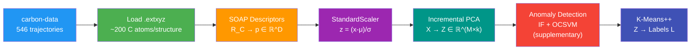

# Carbon Structure Classification

Unsupervised classification of pure carbon material structures using geometric descriptors and machine learning.

**Dataset**: [jla-gardner/carbon-data](https://github.com/jla-gardner/carbon-data) (22.9M carbon atoms)
— CNT, graphene, diamond, buckyball, amorphous carbon

**Paper**: [arXiv:2211.16443](https://arxiv.org/abs/2211.16443)

## Pipeline



### Stages

| Stage | Transformation | Description |
|-------|---------------|-------------|
| 1. Load | `.extxyz` → ASE Atoms | Parse structures with density/temperature metadata |
| 2. SOAP | `R_C → p ∈ ℝ^D` | Rotation-invariant geometric fingerprint (species=['C']) |
| 3. PCA | `X → Z ∈ ℝ^(M×k)` | Dimensionality reduction (≥95% variance) |
| 4. K-Means++ | `Z → L` | Structural clustering |

### Key Design Decisions

- **`species=['C']`** is valid: dataset is 100% Carbon
- **No Carbon filter**: pure C dataset requires no filtering
- **`periodic=True`** in SOAP: structures have periodic boundary conditions
- **Anomaly detection** is supplementary (not in core framework), can be disabled

## Quick Start

### Run on Kaggle

1. Create a new Kaggle Notebook
2. Upload `kaggle_notebook.py` as a script
3. Enable **Internet** (required to download dataset from GitHub)
4. Run all cells — pipeline auto-downloads and processes end-to-end

### Run Locally

```bash
pip install -r requirements.txt
python kaggle_notebook.py
```

### Predict on New Structures

```bash
python predict.py structure.extxyz --models-dir ./models
```

## Configuration

| Parameter | Default | Description |
|-----------|---------|-------------|
| `MAX_TRAJECTORIES` | `None` (all) | Limit number of trajectory files |
| `MAX_SNAPSHOTS` | `50` | Snapshots per trajectory |
| `SOAP_NMAX` | `8` | Radial basis resolution |
| `SOAP_LMAX` | `6` | Angular basis resolution |
| `SOAP_RCUT` | `6.0 Å` | Cutoff radius (~3rd neighbor shell) |
| `SOAP_SIGMA` | `0.5 Å` | Gaussian smearing (tighter for crystalline C) |
| `PCA_VARIANCE` | `0.95` | Variance threshold for PCA |
| `K_RANGE` | `[3-15]` | K candidates for clustering |
| `ANOMALY_ENABLED` | `True` | Enable/disable anomaly detection |
| `FRESH_RUN` | `True` | Delete checkpoints on start |

## Requirements

- Python 3.8+
- dscribe, ase, h5py, scikit-learn, numpy, matplotlib, requests
